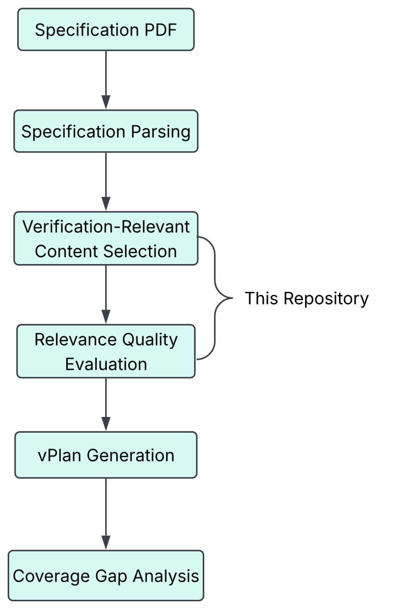

# APRIL AI Hub x Analog Devices
## Verification-Relevant Content Selection and vPlan Evaluation

This repository contains the implementation of the **Verification-Relevant Content Selection** and **Relevance Quality Evaluation** stages of an AI-driven Specification-to-vPlan workflow developed as part of the **APRIL AI Hub Summer Internship Programme**, in collaboration with **Analog Devices**.


The project investigates how Large Language Models (LLMs) and automated processing techniques can transform semiconductor protocol specifications into high-quality, verification-ready datasets suitable for automated vPlan generation.

## Supported Specifications

- AMBA AXI
- RISC-V

## Repository Objectives

The repository prepares verification-ready datasets from structured semiconductor specifications by:

- Identifying verification-relevant protocol requirements.
- Preserving protocol behaviour and timing semantics.
- Removing duplicated requirements.
- Assigning unique requirement identifiers.
- Preserving traceability through section and page metadata.
- Producing structured JSON suitable for automated vPlan generation.
- Evaluating extracted requirements for relevance, completeness and testability.

## Processing Pipeline



## Output

The repository produces a curated dataset containing:

- Verification-relevant requirements
- Protocol rules
- Timing constraints
- Error behaviour
- Reset behaviour
- Corner cases

Each requirement contains:

- Unique Requirement ID
- Requirement text
- Specification section
- Source page
- Related signals
- Requirement type

### Example Output

```json
{
  "id": "REQ_A2_3_015",
  "text": "Transfer occurs only when both VALID and READY are HIGH.",
  "source_section": "A2.3",
  "source_page": 29,
  "signals": [
    "VALID",
    "READY"
  ],
  "type": "protocol_rule"
}
```

## Current Improvements

- Improved protocol requirement extraction
- Implemented duplicate requirement detection
- Added unique requirement ID generation
- Improved requirement quality
- Preserved page-level traceability
- Improved structured JSON output

## Future Work

- Semantic duplicate detection
- LLM-assisted relevance scoring
- Requirement classification
- Automatic quality metrics
- Integration with vPlan generation
- Coverage gap feedback
